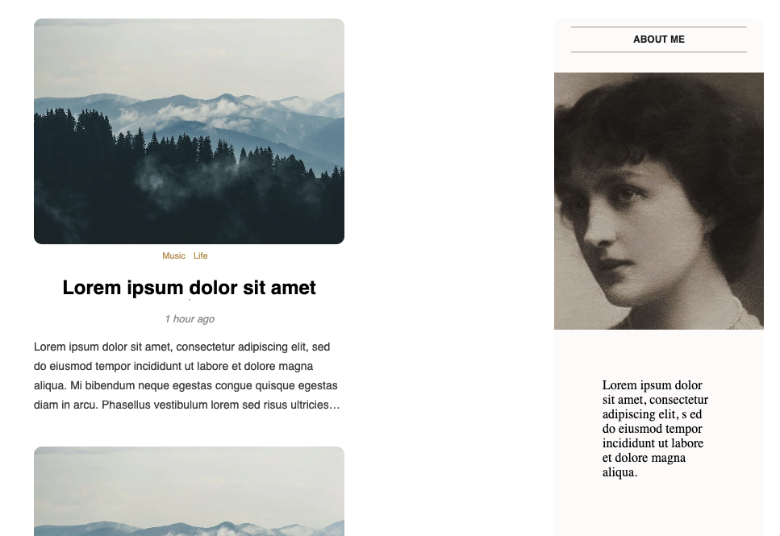

# React Blog Website Design Tutorial


Tutorial URL: https://www.youtube.com/watch?v=tlTdbc5byAs&t=0s
Tutorial description: How to create a blog website using React.js. Blog app React project from scratch for beginners. Design React blog app using functional React components and React Router Dom. First part. Next parts: second -> https://youtu.be/OML9f6LXUUs & third -> https://youtu.be/LelifxOrzvw

___________

### Software versions
- React 18.2.0
### Problems in the project:
1. **500 Internal Server Error**
The POST request to the API didn't respond with a custom json text of "Wrong credentials" instead a 500 bad request.
The problem was I wrote req.status instead of res.status.

```
    // incorrect:
    !user && req.status(400).json('Wrong credentials!');
    !validated  &&  req.status(400).json("Wrong credentials!");
```

```
    // correct: 
    !user && res.status(400).json('Wrong credentials!');
    !validated  &&  res.status(400).json("Wrong credentials!");
```
 There is no such thing as a request status only a response because a response sends a status back

2. "codeName": "FailedToParse" 
    No matter the request body sent to the server, the server returned a response of 500 and MongoDB gave a "failed to parse error". Which means MongoDB failed to parse something, so it wasn't NodeJS which failed to parse something or NodeJS internals. 
    The issue was somewhere in this try/catch block.
    ```
         try {
            const updatedUser = await User.findByIdAndUpdate(
                req.params.id, 
                {
                // incorrect!
                $sat: req.body,
                },
                { new: true }
            );
            res.status(200).json(updatedUser);
        } catch (err) { 
            res.status(500).json(err);
        }
    ```
    I misspelled $set as $sat which caused MongoDB to fail to parse it's query parameters. 
    The correct way was:
    ```
        $set: req.body,
    ```


### How to use
1. Clone / Download
2. cd into the react-blog folder
3. cd into client folder & run npm install first and npm start second
4. cd into api folder & run npm install first and npm start second

### Photos of project:

### Apps used:
- VS Code.
- Vivaldi 
- Mongo DB Compass 1.35.0 (Mac OS Ventura as Mojave is outdated)

### Coding styles I used:
Single brackets instead
### How was it like doing this project this time?
Boring, fun, sad, exciting at different times. Creating that modern input style was effortless than what it seemed. Using Vivladi browser rather than Chrome and Vivaldi shows you the time it took to download an item and more information about what you downloaded. How to play with app development and imagine real users interacting with your app but not in reality. 

### What I learned in this project:
The extra information in a mongoDB object and why developers would only want to use the ._doc object. I can't take the properties exactly from the user object and instead only in this use case one would only need ._doc
```
        // Full user object
            {
            "$__": {
                "activePaths": {
                    "paths": {
                        "password": "init",
                        "email": "init",
                        "username": "init",
                        "profilePic": "init",
                        "_id": "init",
                        "createdAt": "init",
                        "updatedAt": "init",
                        "__v": "init"
                    },
                    "states": {
                        "require": {},
                        "default": {},
                        "init": {
                            "_id": true,
                            "username": true,
                            "email": true,
                            "password": true,
                            "profilePic": true,
                            "createdAt": true,
                            "updatedAt": true,
                            "__v": true
                        }
                    }
                },
                "skipId": true
            },
            "$isNew": false,
             // the ._doc section of the object
            "_doc": {
                "_id": "63e7e0110cd50a2b5e319066",
                "username": "testuser2",
                "email": "testuser2@gmail.com",
                "password": "$2b$10$egzJW1yKyNGUcpauxtrJ4ODusEoY3vfRutaaonPsM/zYnsQnhZsfW",
                "profilePic": "",
                "createdAt": "2023-02-11T18:36:01.669Z",
                "updatedAt": "2023-02-11T18:36:01.669Z",
                "__v": 0
            }
        }
```


